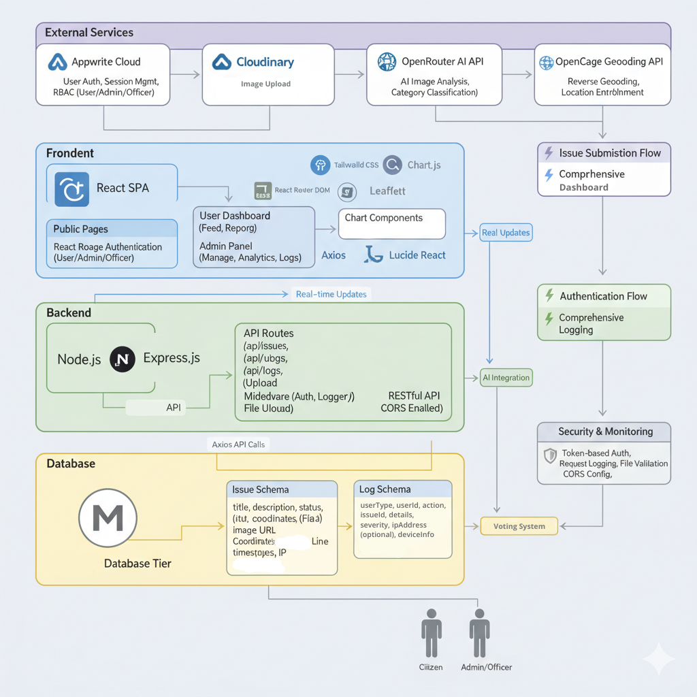

# Smart Community Issue Reporting System

A full-stack web application for citizens to report community issues with GPS location, AI categorization, and real-time admin management. Built for smart cities and civic engagement.

## Features

- **Smart Reporting**: GPS-tagged issue reporting with AI-powered categorization
- **Interactive Maps**: Leaflet-based geolocation and visualization
- **Analytics Dashboard**: Charts and statistics for administrators
- **Community Voting**: Citizens can vote to prioritize issues
- **Role-based Access**: User, Officer (coming soon), and Admin permissions
- **Activity Logging**: Complete audit trails

## Tech Stack

**Frontend:** React 19.1.1, Vite, Tailwind CSS, Leaflet Maps, Chart.js  
**Backend:** Node.js, Express.js, MongoDB, Mongoose  
**Services:** Appwrite (Auth), Cloudinary (Images), OpenRouter AI, OpenCage Geocoding

### System Architecture



*Overview of the Smart Community Issue Reporting System's technical architecture, showing the React frontend, Node.js backend, MongoDB database, and external service integrations.*

## Quick Setup

**Prerequisites:** Node.js 16+, MongoDB, Git

```bash
# Clone and setup backend
git clone https://github.com/tilakjain619/Smart-Community-Issue-Reporting-System.git
cd Smart-Community-Issue-Reporting-System/backend
npm install
cp .env.example .env  # Configure your API keys
npm run dev

# Setup frontend (new terminal)
cd ../frontend
npm install
cp .env.example .env  # Configure endpoints
npm run dev
```

### Environment Variables

**Backend (.env):**
```env
PORT=3000
MONGODB_URI=mongodb://localhost:27017/smart-community
APPWRITE_PROJECT_ID=your_appwrite_project_id
CLOUD_NAME=your_cloudinary_cloud_name
CLOUD_API_KEY=your_cloudinary_api_key
CLOUD_API_SECRET=your_cloudinary_api_secret
OPENROUTER_API_KEY=your_openrouter_api_key
OPENCAGE_API_KEY=your_opencage_api_key
```

**Frontend (.env):**
```env
VITE_BACKEND_URL=http://localhost:3000
VITE_APPWRITE_ENDPOINT=your_appwrite_endpoint
VITE_APPWRITE_PROJECT_ID=your_appwrite_project_id
```

Access: Frontend at `http://localhost:5173`, Backend at `http://localhost:3000`

## API Endpoints

- `GET /api/issues` - Get all issues
- `POST /api/issues` - Create new issue (requires auth)
- `PUT /api/issues/:id/status` - Update status (requires auth)
- `GET /api/issues/search` - Search/filter issues
- `GET /api/logs` - Get activity logs (admin)
- `POST /api/upload` - Upload images (requires auth)

## Contributing

1. Fork the repository
2. Create a feature branch: `git checkout -b feature/name`
3. Make your changes and test
4. Submit a pull request

See [CONTRIBUTING.md](CONTRIBUTING.md) for detailed guidelines.

## Hacktoberfest 2025

Participating in Hacktoberfest! Check [Issues](https://github.com/tilakjain619/Smart-Community-Issue-Reporting-System/issues) for `hacktoberfest` labeled tasks.

## License

MIT License - see [LICENSE](LICENSE) file.